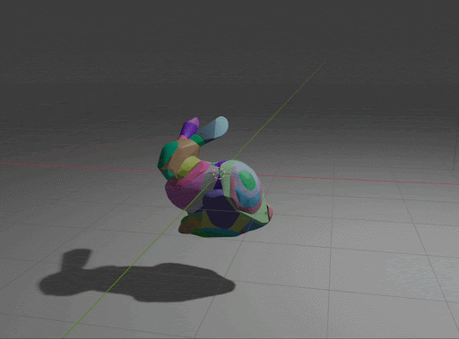

# As-Convex-As-Possible

## Overview

We implemented approximate convex decomposition for triangle meshes using greedy hyperplane search and Monte Carlo tree search (MCTS) from the following papers:
- `Approximate Convex Decomposition and Transfer for Animated Meshes, Thul et. al. 2018` [Link to paper](https://www.microsoft.com/en-us/research/uploads/prod/2019/09/a226-thul.pdf)
- `Approximate Convex Decomposition for 3D Meshes with Collision-Aware Concavity and Tree Search, Wei, Liu et al.` [Link to paper](https://colin97.github.io/CoACD/)

## Results

### Stills

| Bunny                | Armadillo              |
| :----------------- | :----------------- |
|  |  |

### GIFs

| Bunny                | Armadillo              |
| :----------------- | :----------------- |
|  |  |

| Bean                | Cactus              |
| :----------------- | :----------------- |
|  |  |
